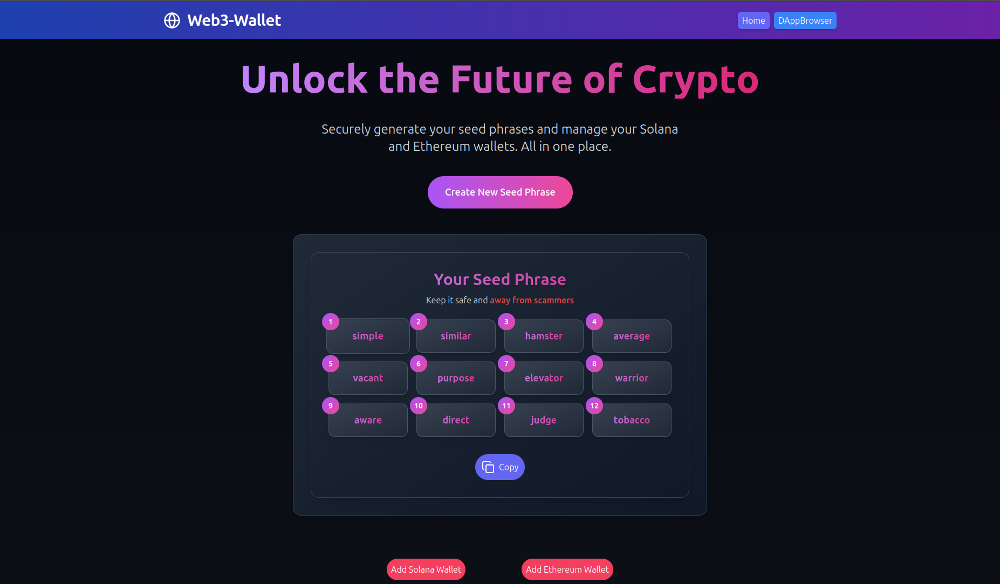
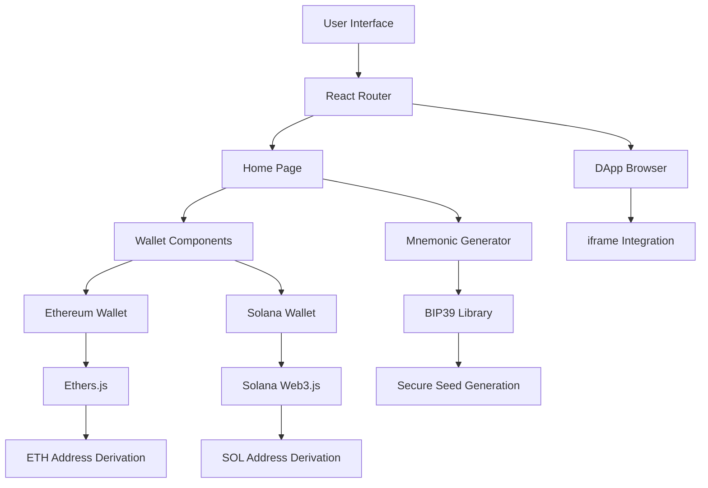
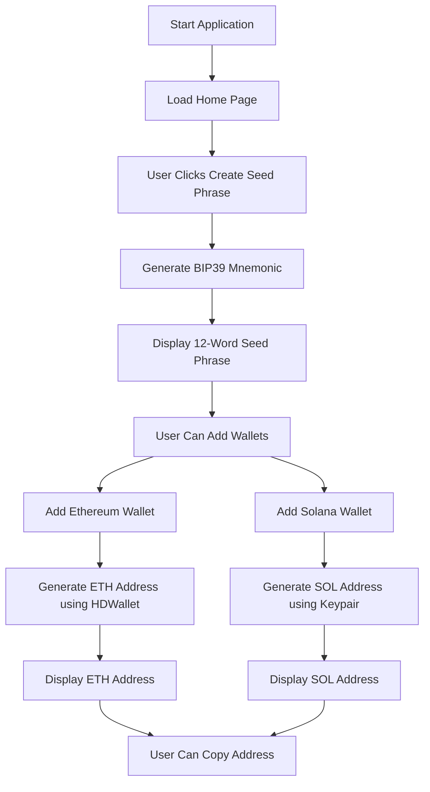
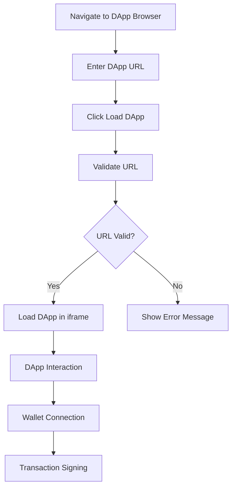
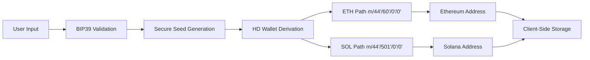
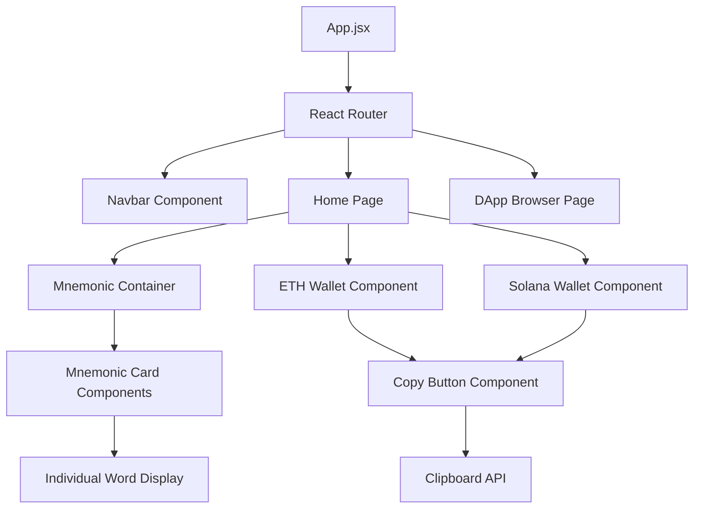

# 🌐 Web3-Wallet: Multi-Chain Cryptocurrency Wallet

<div align="center">
  
  
  [](https://reactjs.org/)
  [](https://vitejs.dev/)
  [](https://ethereum.org/)
  [](https://solana.com/)
  [](LICENSE)
</div>

## 📖 Table of Contents

- [🌟 Overview](#-overview)
- [✨ Features](#-features)
- [🎯 Demo](#-demo)
- [🏗️ System Architecture](#-system-architecture)
- [📊 Application Flow](#-application-flow)
- [🚀 Getting Started](#-getting-started)
- [📂 Project Structure](#-project-structure)
- [🛠️ Technologies Used](#-technologies-used)
- [🔧 Configuration](#-configuration)
- [📱 Usage Guide](#-usage-guide)
- [🔒 Security Features](#-security-features)
- [🤝 Contributing](#-contributing)
- [📄 License](#-license)
- [📞 Contact](#-contact)

## 🌟 Overview

**Web3-Wallet** is a cutting-edge, React-based web application that empowers users to generate secure hierarchical deterministic (HD) wallets for multiple blockchain networks. Built with modern web technologies, it provides a seamless interface for managing Ethereum and Solana wallets from a single mnemonic seed phrase, along with an integrated DApp browser for Web3 interactions.

### 🎯 Key Objectives

- **Security First**: Implement BIP39 standard for secure mnemonic generation
- **Multi-Chain Support**: Unified interface for Ethereum and Solana networks
- **User Experience**: Intuitive design with smooth animations and responsive layout
- **Web3 Integration**: Built-in DApp browser for seamless blockchain interactions

## ✨ Features

### 🔐 Core Wallet Features
- **🎲 Secure Mnemonic Generation**: BIP39-compliant 12-word seed phrases
- **🔄 Hierarchical Deterministic Wallets**: Generate unlimited addresses from single seed
- **⚡ Multi-Chain Support**: Ethereum (ETH) and Solana (SOL) networks
- **📋 One-Click Copy**: Easy copying of addresses and seed phrases
- **🎨 Beautiful UI**: Modern design with Framer Motion animations

### 🌐 Web3 Features
- **🖥️ Integrated DApp Browser**: Browse and interact with decentralized applications
- **🔗 Cross-Chain Compatibility**: Seamless switching between networks
- **📊 Real-Time Analytics**: Vercel Analytics integration for user insights

### 🎨 Design Features
- **📱 Responsive Design**: Optimized for desktop, tablet, and mobile devices
- **🌙 Dark Theme**: Modern dark interface with gradient accents
- **⚡ Smooth Animations**: Framer Motion powered transitions
- **🎯 Accessibility**: Built with accessibility best practices

## 🎯 Demo


**Live Demo**: [Visit Web3-Wallet](https://your-deployment-url.com)

## 🏗️ System Architecture



## 📊 Application Flow

### 🔄 Wallet Generation Flow



### 🌐 DApp Browser Flow



### 🔐 Security Architecture



### 🔄 Component Interaction Flow



## 🚀 Getting Started

### 📋 Prerequisites

Before you begin, ensure you have the following installed:

- **Node.js** (v16.0.0 or later) - [Download](https://nodejs.org/)
- **npm** (v8.0.0 or later) or **yarn** (v1.22.0 or later)
- **Git** - [Download](https://git-scm.com/)
- A modern web browser (Chrome, Firefox, Safari, Edge)

### 🔧 Installation

1. **Clone the Repository**
   ```bash
   git clone https://github.com/VedantAnand17/Web3-Wallet.git
   cd Web3-Wallet
   ```

2. **Install Dependencies**
   ```bash
   # Using npm
   npm install
   
   # Or using yarn
   yarn install
   ```

3. **Start Development Server**
   ```bash
   # Using npm
   npm run dev
   
   # Or using yarn
   yarn dev
   ```

4. **Open Application**
   
   Navigate to `http://localhost:5173` in your browser.

### 🏗️ Build for Production

```bash
# Create production build
npm run build

# Preview production build
npm run preview
```

## 📂 Project Structure

```
Web3-Wallet/
├── 📁 public/                  # Static assets
│   ├── 🖼️ vite.svg            # Vite logo
│   └── 🖼️ web3-wallet.png     # Application banner
├── 📁 src/                     # Source code
│   ├── 📁 components/          # Reusable components
│   │   ├── 📄 CopyButton.jsx   # Copy functionality
│   │   ├── 📄 ETHWallet.jsx    # Ethereum wallet component
│   │   ├── 📄 MnemonicCard.jsx # Individual mnemonic word card
│   │   ├── 📄 MnemonicContainer.jsx # Mnemonic display container
│   │   ├── 📄 Navbar.jsx       # Navigation component
│   │   └── 📄 SolanaWallet.jsx # Solana wallet component
│   ├── 📁 pages/               # Page components
│   │   ├── 📄 Home.jsx         # Main wallet page
│   │   └── 📄 DAppBrowserPage.jsx # DApp browser page
│   ├── 📁 assets/              # Static assets
│   │   └── 🖼️ react.svg       # React logo
│   ├── 📄 App.jsx              # Main application component
│   ├── 📄 App.css              # Application styles
│   ├── 📄 main.jsx             # Application entry point
│   └── 📄 index.css            # Global styles
├── 📁 .github/                 # GitHub workflows
│   └── 📁 workflows/
│       └── 📄 greetings.yml    # Automated greetings
├── 📄 index.html               # HTML template
├── 📄 package.json             # Dependencies and scripts
├── 📄 vite.config.js           # Vite configuration
├── 📄 tailwind.config.js       # Tailwind CSS configuration
├── 📄 eslint.config.js         # ESLint configuration
├── 📄 postcss.config.js        # PostCSS configuration
├── 📄 README.md                # Project documentation
├── 📄 LEARN.md                 # Learning guide
├── 📄 CODE_OF_CONDUCT.md       # Code of conduct
└── 📄 .gitignore               # Git ignore rules
```

## 🛠️ Technologies Used

### 🎨 Frontend Framework
- **React 18.3.1** - Modern React with hooks and concurrent features
- **Vite 5.4.1** - Lightning-fast build tool and development server
- **React Router DOM 6.26.2** - Client-side routing

### 🎭 UI/UX Libraries
- **Tailwind CSS 3.4.10** - Utility-first CSS framework
- **Framer Motion 11.11.1** - Production-ready motion library
- **Lucide React 0.446.0** - Beautiful & consistent icon toolkit
- **Material-UI 5.16.7** - React components implementing Google's Material Design

### 🔐 Blockchain Libraries
- **BIP39 3.1.0** - Bitcoin BIP39 mnemonic code for deterministic keys
- **Ethers.js 6.13.2** - Complete Ethereum wallet implementation
- **@solana/web3.js 1.95.2** - Solana's JavaScript SDK
- **ed25519-hd-key 1.3.0** - Hierarchical deterministic keys for ed25519
- **tweetnacl 1.0.3** - Cryptographic functions

### 📊 Analytics & Monitoring
- **@vercel/analytics 1.3.1** - Privacy-friendly analytics

### 🔧 Development Tools
- **ESLint 9.9.0** - Pluggable JavaScript linter
- **Autoprefixer 10.4.20** - PostCSS plugin to parse CSS
- **vite-plugin-node-polyfills 0.22.0** - Node.js polyfills for Vite

## 🔧 Configuration

### 🌐 Environment Variables

Create a `.env` file in the root directory:

```env
# Application Configuration
VITE_APP_NAME=Web3-Wallet
VITE_APP_VERSION=1.0.0

# Blockchain Network URLs (Optional)
VITE_ETHEREUM_RPC_URL=https://mainnet.infura.io/v3/YOUR_PROJECT_ID
VITE_SOLANA_RPC_URL=https://api.mainnet-beta.solana.com

# Analytics (Optional)
VITE_VERCEL_ANALYTICS_ID=your_analytics_id
```

### ⚙️ Vite Configuration

The project uses a custom Vite configuration with Node.js polyfills:

```javascript
// vite.config.js
import { defineConfig } from 'vite'
import react from '@vitejs/plugin-react'
import { nodePolyfills } from 'vite-plugin-node-polyfills'

export default defineConfig({
  plugins: [react(), nodePolyfills()],
})
```

## 📱 Usage Guide

### 🔐 Generating a Wallet

1. **Access the Application**: Open the Web3-Wallet in your browser
2. **Create Seed Phrase**: Click the "Create Seed Phrase" button
3. **Secure Your Mnemonic**: Copy and securely store your 12-word mnemonic
4. **Generate Addresses**: Use "Add Ethereum Wallet" or "Add Solana Wallet" buttons

### 💳 Managing Multiple Wallets

```javascript
// Each wallet follows BIP44 derivation paths:
// Ethereum: m/44'/60'/account'/0/address_index
// Solana: m/44'/501'/account'/0'
```

### 🌐 Using the DApp Browser

1. **Navigate to DApp Browser**: Click "DAppBrowser" in the navigation
2. **Enter DApp URL**: Input the URL of your desired DApp
3. **Load DApp**: Click "Load DApp" to interact with the application

### 📋 Copying Addresses

- Click the copy button next to any generated address
- The address will be copied to your clipboard
- Visual feedback confirms successful copying

## 🔒 Security Features

### 🛡️ Security Best Practices

- **Client-Side Generation**: All keys generated locally in your browser
- **No Server Storage**: Mnemonics and private keys never leave your device
- **BIP39 Standard**: Industry-standard mnemonic generation
- **Secure Randomness**: Cryptographically secure random number generation

### ⚠️ Security Warnings

> **⚠️ IMPORTANT SECURITY NOTICE**
> 
> - **Never share your mnemonic phrase** with anyone
> - **Store your mnemonic offline** in a secure location
> - **This is a demo application** - do not use for storing significant funds
> - **Always verify addresses** before sending transactions

### 🔐 Recommended Security Practices

1. **Backup Strategy**: Write down your mnemonic on paper and store in multiple secure locations
2. **Verification**: Always verify generated addresses on multiple devices
3. **Network Security**: Use HTTPS and avoid public WiFi for wallet operations
4. **Regular Updates**: Keep the application and dependencies updated

## 🧪 Testing & Quality Assurance

### 🔍 Code Quality Tools
- **ESLint**: JavaScript/React code linting with custom rules
- **Prettier**: Code formatting for consistent style
- **Husky**: Git hooks for pre-commit validation

### 🧩 Testing Strategy
```bash
# Run linting
npm run lint

# Fix linting issues
npm run lint:fix

# Check build
npm run build
```

## 🚀 Deployment

### 📦 Build Process
```bash
# Production build
npm run build

# The build artifacts will be stored in the `dist/` directory
```

### 🌐 Deployment Platforms
- **Vercel**: Recommended for React applications
- **Netlify**: Alternative static hosting
- **GitHub Pages**: Free hosting for open source projects

### 🔒 Environment Setup
```bash
# Set production environment variables
VITE_APP_ENV=production
VITE_APP_URL=https://your-domain.com
```

## 🤝 Contributing

We welcome contributions from the community! Here's how you can help:

### 🌟 Ways to Contribute

- 🐛 **Bug Reports**: Report issues you encounter
- 💡 **Feature Requests**: Suggest new features or improvements
- 📝 **Documentation**: Improve documentation and guides
- 🔧 **Code Contributions**: Submit bug fixes or new features
- 🎨 **Design**: Contribute to UI/UX improvements

### 📋 Contribution Guidelines

1. **Fork the Repository**
   ```bash
   git clone https://github.com/your-username/Web3-Wallet.git
   ```

2. **Create a Feature Branch**
   ```bash
   git checkout -b feature/amazing-feature
   ```

3. **Make Your Changes**
   - Follow the existing code style
   - Add tests for new features
   - Update documentation as needed

4. **Commit Your Changes**
   ```bash
   git commit -m 'Add some amazing feature'
   ```

5. **Push to Your Branch**
   ```bash
   git push origin feature/amazing-feature
   ```

6. **Open a Pull Request**
   - Provide a clear description of your changes
   - Link any related issues
   - Ensure all tests pass

### 📝 Code Standards

- **ESLint**: Follow the configured ESLint rules
- **Prettier**: Use Prettier for code formatting
- **Commits**: Use conventional commit messages
- **Testing**: Add tests for new functionality

## 🐛 Troubleshooting

### Common Issues

1. **Node.js Version Issues**
   ```bash
   # Check Node.js version
   node --version
   
   # Update to latest LTS
   nvm install --lts
   nvm use --lts
   ```

2. **Dependency Installation Problems**
   ```bash
   # Clear npm cache
   npm cache clean --force
   
   # Delete node_modules and reinstall
   rm -rf node_modules package-lock.json
   npm install
   ```

3. **Build Errors**
   ```bash
   # Check for ESLint errors
   npm run lint
   
   # Fix auto-fixable issues
   npm run lint:fix
   ```

## 📊 Performance Metrics

### 🚀 Bundle Size Optimization
- **Tree Shaking**: Unused code elimination
- **Code Splitting**: Lazy loading for better performance
- **Asset Optimization**: Compressed images and fonts

### 📈 Performance Benchmarks
- **First Contentful Paint**: < 1.5s
- **Largest Contentful Paint**: < 2.5s
- **Cumulative Layout Shift**: < 0.1

## 📄 License

This project is licensed under the **MIT License** - see the [LICENSE](LICENSE) file for details.

```
MIT License

Copyright (c) 2024 Vedant Anand

Permission is hereby granted, free of charge, to any person obtaining a copy
of this software and associated documentation files (the "Software"), to deal
in the Software without restriction, including without limitation the rights
to use, copy, modify, merge, publish, distribute, sublicense, and/or sell
copies of the Software, and to permit persons to whom the Software is
furnished to do so, subject to the following conditions:

The above copyright notice and this permission notice shall be included in all
copies or substantial portions of the Software.
```

## 📞 Contact

<div align="center">

**Vedant Anand** - *Project Creator & Maintainer*

[](mailto:vedantanand.in@gmail.com)
[](https://github.com/VedantAnand17)
[](https://linkedin.com/in/vedantanand17)

</div>

---

### 🙏 Acknowledgments

- **React Team** for the amazing React framework
- **Vite Team** for the blazing-fast build tool
- **Ethereum Foundation** for Ethereum ecosystem tools
- **Solana Labs** for Solana development tools
- **Open Source Community** for the incredible libraries used

### 🚀 What's Next?

- [ ] **Mobile App**: React Native implementation
- [ ] **Hardware Wallet**: Integration with Ledger/Trezor
- [ ] **Multi-Language**: Internationalization support
- [ ] **Advanced Analytics**: Portfolio tracking and analytics
- [ ] **NFT Support**: NFT viewing and management
- [ ] **DeFi Integration**: Built-in DeFi protocol interactions
- [ ] **Multi-Signature**: Multi-sig wallet support
- [ ] **Transaction History**: Detailed transaction tracking
- [ ] **Price Tracking**: Real-time cryptocurrency prices
- [ ] **Staking**: Built-in staking functionality

---

<div align="center">
  <p>Made with ❤️ by <a href="https://github.com/VedantAnand17">Vedant Anand</a></p>
  <p>⭐ Star this repository if you found it helpful!</p>
</div>
